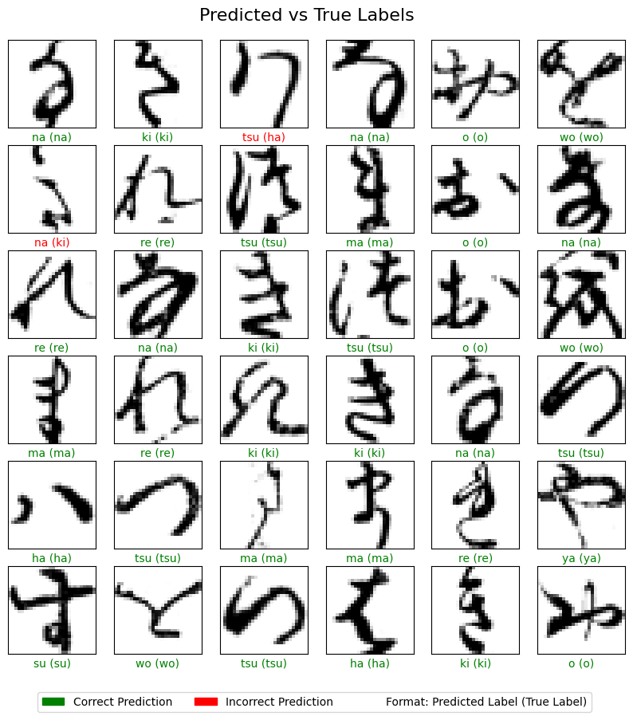
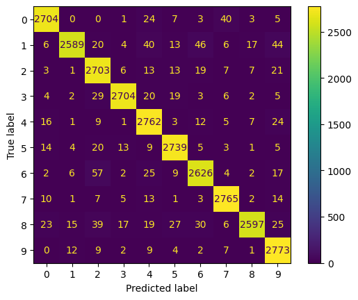
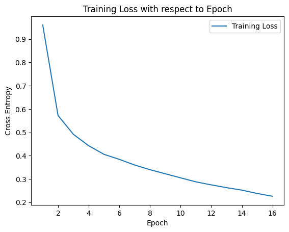

# Classifying Images with Neural Networks
Computer vision experimentation using ANNs and CNNs to classify different types of images.

### [1] Description
This repository consists of two computer vision projects. The first project uses artificial neural networks to classify grayscale Japanese handwritten Kanji characters. The second project uses advanced convolutional neural networks to classify coloured images of objects and animals.

### [2] Use Case
These projects enable a computer to easily classify images and match them to their true contents with a relatively high accuracy.

### [3] Repository Contents
1) **ANN Image Classifier.ipynb** 
This classifier is built based on the k_mnist dataset, which is available [here](https://www.tensorflow.org/datasets/catalog/kmnist). More details about the dataset can be found [here](https://github.com/rois-codh/kmnist). For this classifier, I am limiting myself to only using dense ANNs rather than advanced CNNs. The Kuzushiji-MNIST dataset contains 70,000 28x28 grayscale images spanning 10 classes of Japanese characters.  In this project, I built an ANN using TensorFlow and Keras with 1 input layer, 3 additional hidden layers (using a ReLU activation function), and one final output layer (using a softmax activation function). I then compiled and trained the model with a cross-entropy loss function because of its suitability for classification problems with multiple classes and integer labels. The overall test accuracy achieved was consistently above 96%. Below is a visual representation of the predictions and a confusion matrix visualizing the evaluation metrics of the model. 

   
  Visual Representation of Predictions vs True Labels.

 

   
  Confusion Matrix of Prediction vs True Labels.

 

2) **CNN Image Classifier (Transfer Learning).ipynb** 
This classifier was built based on a pre-trained network (MobileNetV2) to do image classification on the CIFAR-10 dataset. More information on the dataset is available [here](https://www.cs.toronto.edu/~kriz/cifar.html). For this classifier, I explore the use of transfer learning in the context of CNNs. The CIFAR-10 dataset consists of 60000 32x32 colour images in 10 classes, with 6000 images per class. There are 50000 training images and 10000 test images.  In this project, I first downloaded the pre-trained MobileNetV2 network from [Keras Applications](https://keras.io/applications/) and upsized the CIFAR-10 images to match the dimensions requirements of the pre-trained MobileNetV2 model. Subsequently, I removed the final output layer and froze the base model to perform transfer learning and extend the base MobileNetV2 model. Like the ANN project above, I compiled and trained the model with a cross-entropy loss function. A total of 6 layers were added to the base model, comprising 1 global average pooling layer, 1 batch normalization layer, 3 dense layers, and 1 dropout layer. A ReLU activation function was used for the inner dense layers, and the final dense output layer was given a softmax activation function. A test accuracy of around 87% was achieved during the evaluation phase.  A mini-batch size of 32 was selected for training. This value was chosen as the number 32 is considered a standard choice for many deep learning models. 32 is considered a good default value as it strikes a balance between memory usage, training time, and model performance. A larger batch size could lead to more stable and robust convergence and reduce training time but run the risk of exceeding the training computer’s limited available memory, especially since the resized training and test images take up a large portion of RAM. A smaller batch size could lead to faster convergence and better accuracy but run the risk of instability and longer training time.  An early stopping condition was added to the model to determine when to terminate training. The stopping function decides to terminate training if the validation accuracy does not change by more than a min_delta of 0.0001 for a patience of 5 epochs. As training the model takes some time, stopping the training process in advance when training results start to stagnate enables more efficient training. As seen from the graph below, the training terminated early at 16 epochs, much earlier than the pre-set 30 epochs that I initially set. 

   
  Visual Representation of Predictions vs True Labels.

 

### [4] Author
Martin Cheng

### [5] References
1) **Deep Learning for Classical Japanese Literature. Tarin Clanuwat et al. [arXiv:1812.01718](https://arxiv.org/abs/1812.01718)**
2) **[Learning Multiple Layers of Features from Tiny Images](https://www.cs.toronto.edu/~kriz/learning-features-2009-TR.pdf), Alex Krizhevsky, 2009.**
